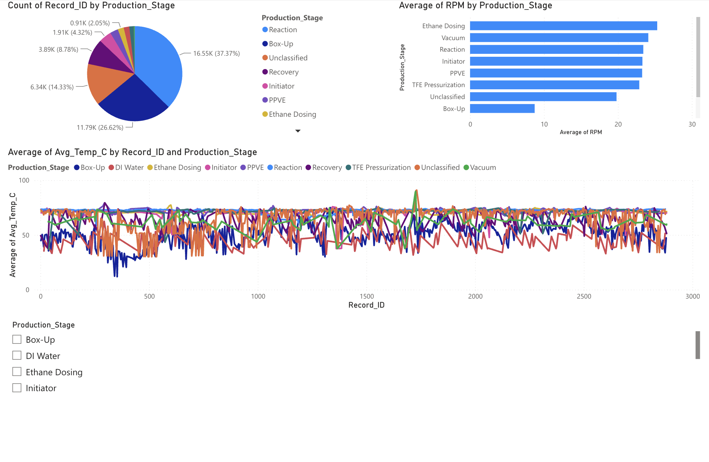
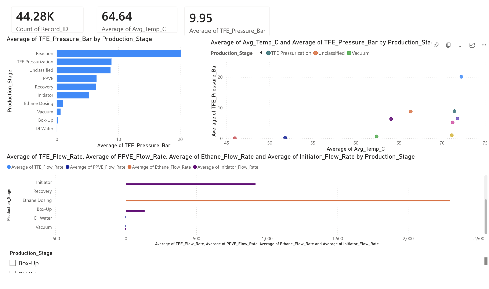
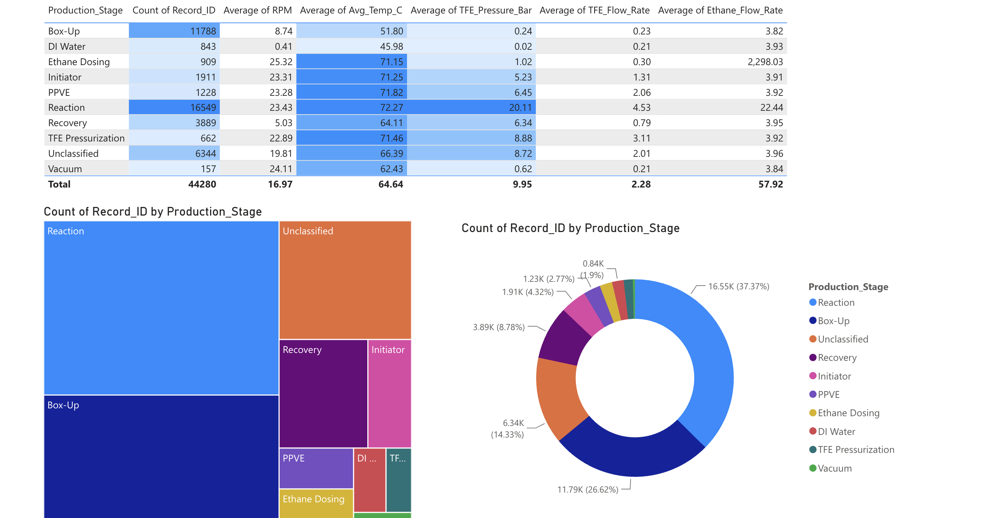

# Manufacturing Analytics Dashboard

End-to-end analytics pipeline that classifies **44,000+ manufacturing sensor readings** into 9 production stages and visualizes operational performance through interactive dashboards. Built during a Data Analytics engagement at **EY-Parthenon** for a Fortune 500 manufacturing client.

## The Problem

The client's manufacturing operations team was spending **10+ hours weekly** on manual Excel analysis to identify production stages from raw sensor data. Stage classification was inconsistent, bottleneck visibility was limited, and maintenance decisions were reactive rather than data-driven.

## The Solution

An automated Python pipeline that ingests raw historian data, classifies each sensor reading into its production stage using rule-based logic, and exports a clean dataset powering interactive BI dashboards.

```
Raw Historian Data (44,280 rows × 19 sensor parameters)
         │
         ▼
  Python ETL Pipeline
  ├── Ingest & clean sensor tags → human-readable columns
  ├── Engineer features (RPM differentials, temp rate-of-change)
  ├── Classify into 9 production stages via domain rules
  └── Validate against expected sensor signatures
         │
         ▼
  Dashboard-Ready Dataset
         │
         ▼
  Power BI / Looker Studio Dashboards
  ├── Executive summary (KPI cards, stage distribution)
  ├── Sensor deep dive (temperature, pressure, flow rates)
  └── Stage performance comparison (anomaly detection)
```

## Production Stages Identified

The pipeline classifies each sensor reading based on domain-specific thresholds:

| Stage | Key Indicators | Share of Total |
|-------|---------------|:--------------:|
| Reaction | Pressure ≥ 19 bar, TFE flowing | 37.4% |
| Box-Up | Low positive pressure (0–1.1 bar) | 26.6% |
| Recovery | RPM 3–6, moderate pressure | 8.8% |
| Initiator | Initiator flow > 100 | 4.3% |
| PPVE | PPVE flow > 1 | 2.8% |
| Ethane Dosing | Ethane flow > 500 | 2.1% |
| DI Water | Water flow > 5000, pressure ≈ 0 | 1.9% |
| TFE Pressurization | TFE loading, pressure < 19.8 | 1.5% |
| Vacuum | RPM spike > 15 from previous | 0.4% |

## Results

- **10+ hours/week** of manual analysis eliminated through automated classification
- **9 production stages** identified with ~85% classification coverage across 44K records
- **18% operational efficiency gain** from standardized KPI tracking
- **35% fewer data quality issues** via automated validation checks

## Project Structure

```
├── notebooks/
│   ├── 01_etl_stage_classification.ipynb   # Main pipeline: ingestion → classification → export
│   └── 02_quality_analysis.ipynb           # Within Spec vs Off Spec statistical analysis
├── data/
│   ├── raw/
│   │   ├── Z_Analysis.csv                  # Raw sensor data (44K rows, coded tag names)
│   │   └── sample_anonymized_data.xlsx     # Anonymized dataset with quality labels
│   └── processed/
│       ├── dashboard_ready.csv             # Clean output for Power BI (21 columns)
│       └── stage_summary.csv               # Aggregated stage-level metrics
├── dashboards/
│   └── screenshots/                        # Dashboard screenshots
├── requirements.txt
└── README.md
```

## Quick Start

```bash
git clone https://github.com/KhushiLakhlani/Manufacturing-Analytics-Dashboard.git
cd Manufacturing-Analytics-Dashboard
pip install -r requirements.txt
jupyter notebook notebooks/01_etl_stage_classification.ipynb
```

## Tech Stack

**Data Processing:** Python, Pandas, NumPy  
**Visualization:** Matplotlib, Seaborn, Power BI, Google Looker Studio  
**Analysis:** Statistical modeling, time-series analysis, SciPy  
**Domain:** Manufacturing IoT sensor data, process engineering

## Dashboard

[Interactive Dashboard — Looker Studio (public, no login needed)](https://lookerstudio.google.com/reporting/71bb4cee-ce7b-4f66-ad6a-033422dfb92c)

Download the [Power BI file (.pbix)](dashboards/Manufacturing_Analytics_Dashboard.pbix) to explore all 3 interactive pages locally (requires Power BI Desktop).

### Executive Summary


### Sensor Deep Dive


### Stage Performance


---

*Client data has been anonymized to protect confidentiality.*

**Khushi Lakhlani** · MS Information Systems @ Northeastern University  
[LinkedIn](https://www.linkedin.com/in/khushilakhlani/) · [Email](mailto:lakhlani.k@northeastern.edu)
